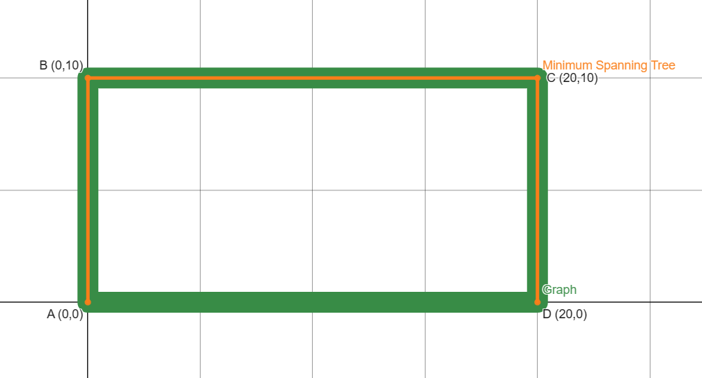
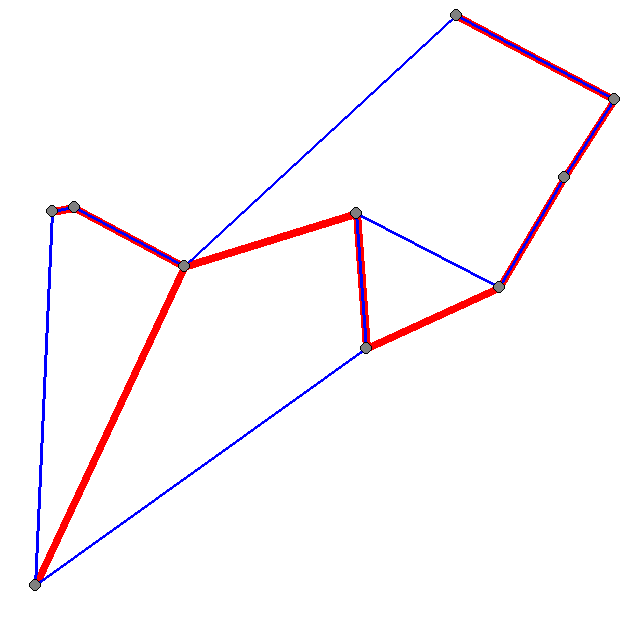
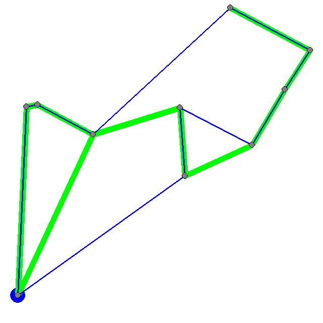
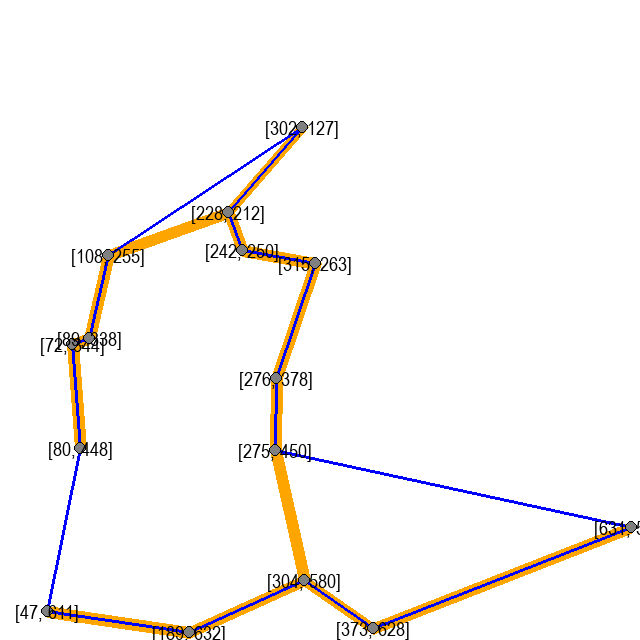
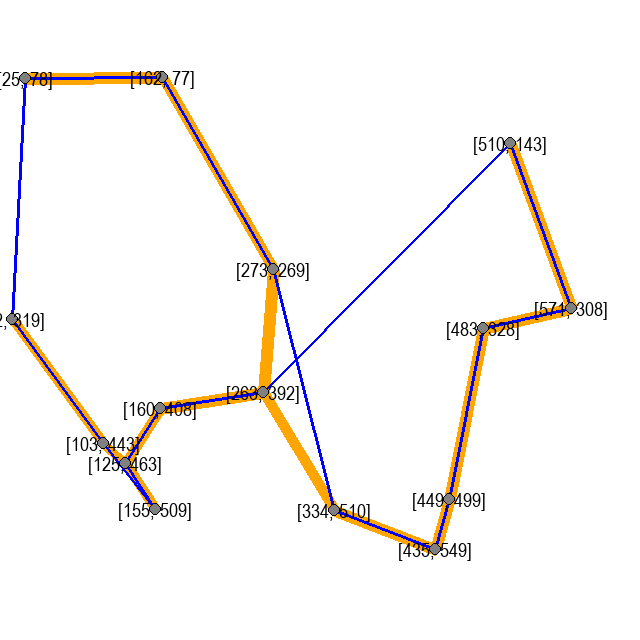

# The-Traveling-Salesman-Problem

My solutions to the Traveling Salesman Problem (TSP) inspired by video presented by Reducible on Youtube. 
(https://youtu.be/GiDsjIBOVoA)

--------------------------------------------------------------------------------------------------------------
**TSP Problem Definition**

_If a salesman starts at a town and wants to travel to every other town only once, what is the shortest path he should take such that he ends up in the town he started in?_

Assuming that:
1. Each town is connected by a direct edge
2. The distance between town A and town B is the same as the distance between town B and town A
3. The direct path to a town is always the shortest, i.e. going directly from town A to town C is faster than going from town A to town B and then town C

--------------------------------------------------------------------------------------------------------------
**Method 1: Brute Force**

By checking every single possibility and calculating the distance of each route, the shortest path can be determined. As **n**, the number of towns, increases, on the first turn, (starting at any town) there are n-1 towns to choose from, then on the second turn there are n-2 choices and so on until there is only one option left which is to return to the starting town. This means that there are `(n - 1)! / 2` total possibilities accounting for duplicates. This strategy while easy to implement, is not suited to calculating more than 20 nodes as the number possibilities that would be considered at _n=20_ is `(20-1)!/2 = 60,822,550,204,416,000`. 

--------------------------------------------------------------------------------------------------------------
**Method 2: Nearest Neighbor (NN) Heuristic**

If we start at any town and find the closest town that we haven't been to yet and continue this until all the cities have been visited, this creates a complete tour.

--------------------------------------------------------------------------------------------------------------
**Lower Bound and the Optimal Solution**

In the case of the TSP, finding the optimal solution for a large number of nodes can end up taking too much time to compute, meaning that we have nothing to compare our heuristic solutions to. 
This is where the **Minimum Spanning Tree (MST)** comes in. 
_The minimum spanning tree is the set of edges that connects all the nodes with the minimum cost (in the case of the TSP, the costs is the distance between nodes) and no cycles._ A different way of thinking about it would be to find all the shortest distances between nodes and add that edge into the MST until we have connected all the nodes.

**For example:** A graph with 4 nodes: A,B,C,D at (0,0), (0,10), (20,0), (20,10) respectively on the Cartesian Plane will have a MST of 40.0.
This is because the MST only needs to connect all the nodes in the shortest distance possible, which in this case would be the edges AB + BC + CD. There is also another MST that is equally good which is simply AB + AD + CD.

The usefulness of the MST lies in the fact that the optimal tour which in the case of the example above is highlighted in green, is always greater than the MST. This is true because if you were to take the optimal solution and remove any of the edges (to create no cycles), you would be left with a spanning tree which would be greater than or equal to the minimum spanning tree. 
Therefore, the `MST Cost < Optimal Tour Cost` Since we are not trying to find the optimal solution, but a solution that is good enough and that we can calculate within a reasonable amount of time (heuristic solution) we can compare our solution to the minimum spanning tree and get an approximation ratio.

Take this graph for instance. The grey circles represent nodes or towns in the TSP, the blue line represents the Nearest Neighbor heuristic solution and the red line represents the MST. 

By calculating each of the distances in the MST, we can determine that the `MST Cost = 1360.299` and the `Tour Cost = 1,994.528`. We can now determine the approximation ratio by simply dividing the tour cost by the MST cost.

`Tour Cost / MST Cost = 1,994.528 / 1360.299 = 1.466`

`1.466 * 100% - 100% = 46.6% `

By manipulating the result, we can determine how much our solution overshot the lower bound.
Of course this value does not represent to a high degree of accuracy how much we overshot the optimal solution, but it does give us ballpark numbers.
In this case, the approximation ratio is `46.6%` of the MST.
(As an exercise to the reader, can you determine to why the Minimum Spanning Tree shown in the graph above is correct?)

**The One Tree**

The One Tree is an even better lower bound which will be greater than the MST, but still less than the optimal tour.
`MST Cost < One Tree Lower Bound Cost < Optimal Tour Cost` This lower bound will be more useful than the MST because it will give us more precise approximation ratios as the One Tree lower bound will be closer to the optimal solution. 
But, how do we determine the One Tree Lower Bound?
1. If we remove any vertex from the graph and find the MST of the remaining nodes
2. Then connect the two shortest edges to the removed vertex back into the tree

This one tree is guaranteed to give a cost that is lower than the optimal cost, but still greater than the MST because by adding in the two closest distances, we create the shortest possible cycle to connect the removed vertex (and the rest of the vertices are connected using the MST)  while the optimal tour has to go all the way around to create a cycle.   
In this example, the blue line represents the Nearest Neighbor heuristic solution, the blue dot represents the removed vertex and the green line represents the One Tree.

Another thing we can do to ensure that the One Tree Lower Bound is maximized (since we want it as close as possible to the optimal tour cost) is to calculate the one tree, but we remove a different vertex each time until all the possible one trees have been determined.
Using this one tree cost, we can now determine a better approximation ratio.
In this example, the `One Tree Lower Bound Cost = 1,734.686` and the `Tour Cost = 1,994.528`. We can now determine the approximation ratio by simply dividing the tour cost by the One Tree Lower Bound Cost.

`Tour Cost / One Tree Lower Bound Cost = 1,994.528 / 1,734.686 = 1.150`

`1.150 * 100% - 100% = 15.0%`

In this case, the approximation ratio is `15.0%` of the One Tree Lower Bound Cost! This is a significantly better approximation of how close we are to the optimal tour cost compared to the approximation ratio using the MST.  

Using these new approximation ratios, we can now determine how effective different heuristic approaches are to the optimal solution.

--------------------------------------------------------------------------------------------------------------
**Method 3: Greedy Heuristic**

If we use an approach similar to how we created the Minimum Spanning Tree, we can apply similar logic to create a good heuristic. In each iteration, we determine the shortest edge distance to add to the route, however we must follow the rules that each town is connected to exactly 2 other towns and by adding an edge, we do not create a cycle of length smaller than n.

--------------------------------------------------------------------------------------------------------------
**Method 4: The Christofides Algorithm**

When we compare the MST to the optimal solution, they often share many of the same edges. Meaning that if we modify the MST into a TSP tour, it will be very similar to the optimal solution.

Take the above graph for instance. The blue lines represent a TSP tour created using the Christofides Algorithm while the orange lines represent the MST.
The Christofides Algorithm creates a tour by:
1. Finding all odd degree vertices in the MST. Each node in the MST connects a number of other nodes, this number is the degree of the node. For example, the node at (276,378) connects to 2 other nodes, namely (275, 450) and (215, 263). Therefore it has degree 2.
2. Find the perfect matching of all odd degree vertices. By taking each odd degree vertex and creating an edge with another vertex such that all odd degree vertices have been paired up with the minimum cost, we can determine the perfect matching. (Note: In any graph, the sum of all the vertex degrees is equal to twice the number of edges. Therefore, there can not be an odd number of odd degree vertices)
3. Combine the perfect matching and the MST into a multi-graph. This graph will by definition have only even degree vertices (since the MST's odd degree vertices will each receive one more edge therefore its odd degree will become and even degree)
4. Construct an Eulerian Tour of the multi-graph by passing through each edge once until all edges have been passed through.
5. Construct a TSP tour by going through the Eulerian tour and when we encounter a node we have already visited, simply skip over it and connect the previous node to the next one that has not been visited yet.

--------------------------------------------------------------------------------------------------------------

**Tour Improvement**

Typically, the heuristic solutions can generate a decent solution to the TSP, but they are often constricted simply by the idea that defines them.
Take this graph for instance, generated by the Christofides Algorithm.  

If you notice the edge between (273, 269) and (334,510) and the edge between (263, 392) and (510, 143). They cross each other and it would probably be a better solution if they connected differently.
This method of improving a candidate solution created by a heuristic is called local search.

--------------------------------------------------------------------------------------------------------------

**Random Swapping**

